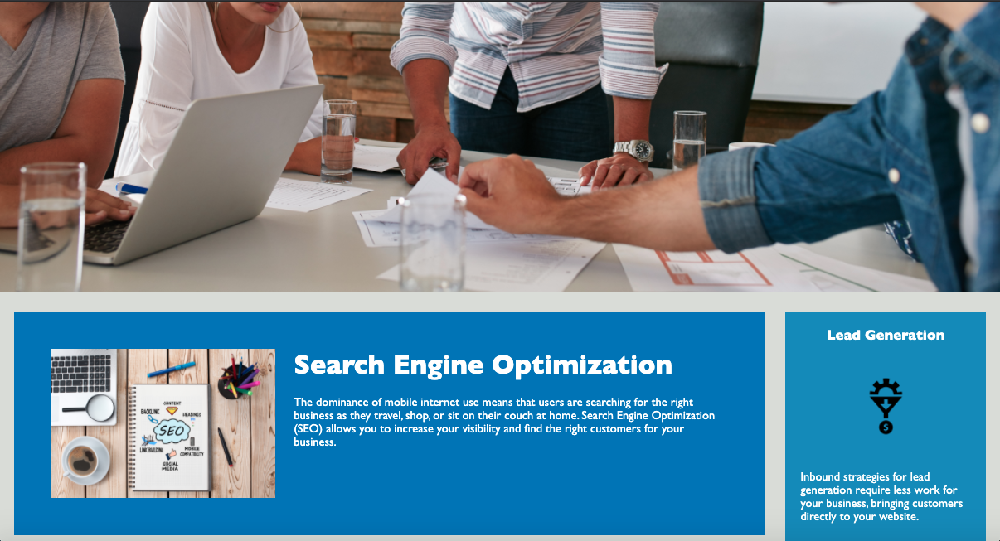

## Code Refactor AK

## Description 
I changed most of the elements in the HTML code to semanitic elements for search engine optimization and accessibility. I also reorganized most of the CSS code to fit the ordered structure of the HTML. Meaning the CSS code follows along and is group together with each section of the HTML code as you scrole from top to bottom.

## User Story 
AS A marketing agency
I WANT a codebase that follows accessibility standards
SO THAT our own site is optimized for search engines

## Screenshots

## Link
https://aken00.github.io/Code-Refactor-AK 
